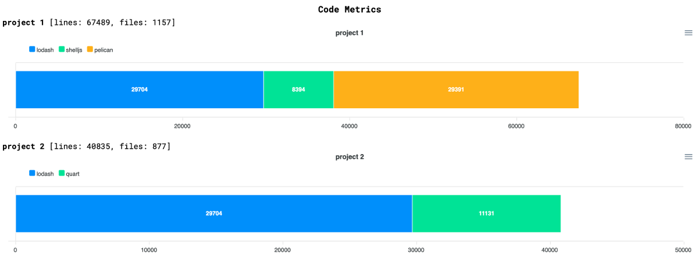

# cmetrix

[](https://github.com/pierreroth64/cmetrix/actions?query=workflow%3ACI) [](https://badge.fury.io/js/cmetrix) [](https://github.com/prettier/prettier)

_CLI to build code metrics charts for your projects_

<p align="center">
  
</p>

## Purpose

Your team is working on several projects. Each project is composed of several repositories.
You would like to have an overview of the amazing work that has been done.

Run `cmetrix` and you will get beautiful charts (thanks to [cloc](https://github.com/AlDanial/cloc) and [apexcharts](https://apexcharts.com/) used under the hood)

## Installation

- Install [NodeJS](https://nodejs.org/)
- Install [cloc](https://github.com/AlDanial/cloc)
- Then run `npx cmetrix --help`

## Usage

First, you have to describe your projects in a JSON configuration file.
Then, just run `npx cmetrix charts -c <configuration-file>.json`

(`npx cmetrix charts --help` for more options)

### Example

Just run: `npm run example`

### Configuration file

A simple JSON configuration file example is available in the `./examples` directory. You can add `languages` and `excludeDirs` to have a better repository analysis.

```json5
{
  projects: [
    {
      name: 'project 1',
      repositories: [
        { name: 'lodash' },
        { name: 'shelljs' },
        { name: 'pelican' },
      ],
    },
    {
      name: 'project 2',
      repositories: [{ name: 'lodash' }, { name: 'quart' }],
    },
  ],
  repositories: [
    {
      name: 'lodash',
      url: 'git@github.com:lodash/lodash.git',
      excludeDirs: ['node_modules'], // <- you can exclude dirs from analysis
      tag: '3.10.1', // <- you can checkout a given tag
    },
    {
      name: 'shelljs',
      url: 'https://github.com/shelljs/shelljs.git',
      languages: ['JavaScript', 'TypeScript'], // <- you can filter on languages
    },
    { name: 'quart', url: 'https://gitlab.com/pgjones/quart.git' },
    { name: 'pelican', url: 'https://github.com/getpelican/pelican.git' },
  ],
}
```

### Authentication

You can pass authentication tokens to `cmetrix` when accessing private repositories through `https://` using the following environment variables: `CMETRIX_GITHUB_TOKEN`, `CMETRIX_GITLAB_TOKEN`, `CMETRIX_BITBUCKET_TOKEN`.

⚠️ Do not fill your configuration file with tokens: `cmetrix` will do the job for you.

Example if you have private repos in github and gitlab: `CMETRIX_GITHUB_TOKEN=aabbccddaabbccdd CMETRIX_GITLAB_TOKEN=1122334455 npx cmetrix charts -c <configuration-file>.json`

## Development

```
  npm run build
  npm start -- charts --help
```

Note: you can run the example: `npm run build && npm start -- charts -c examples/conf.json --open`
